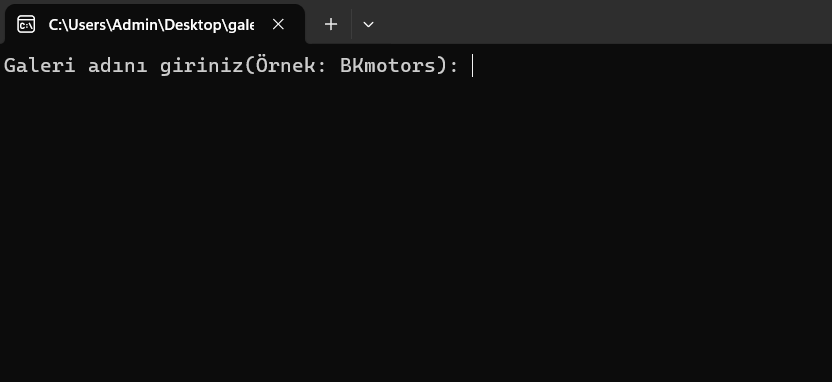
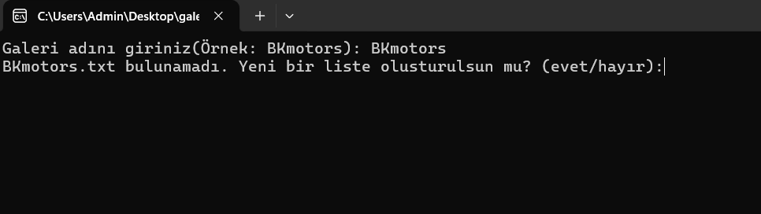
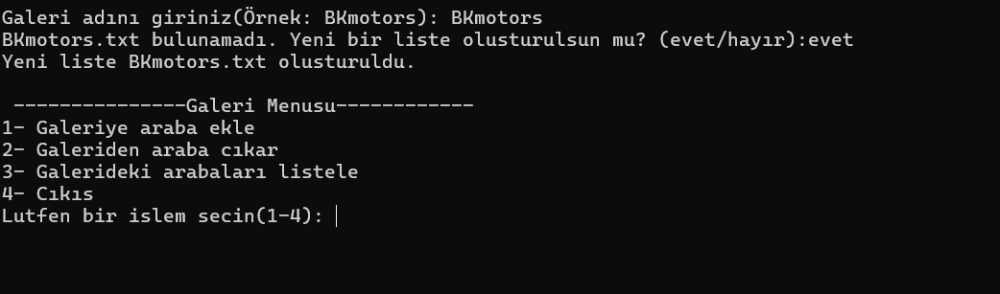
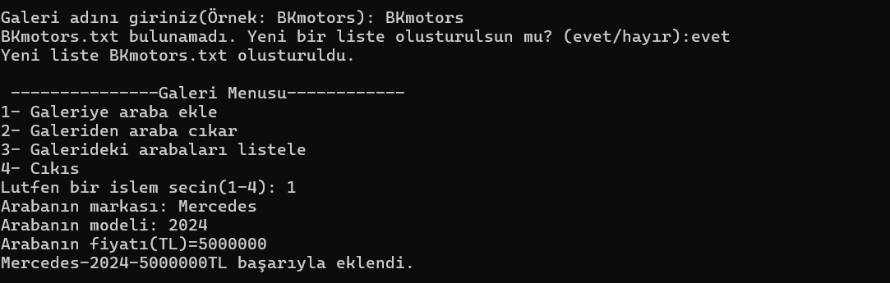
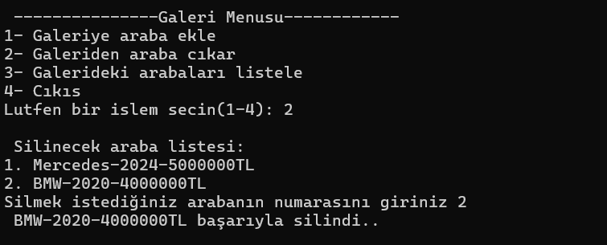
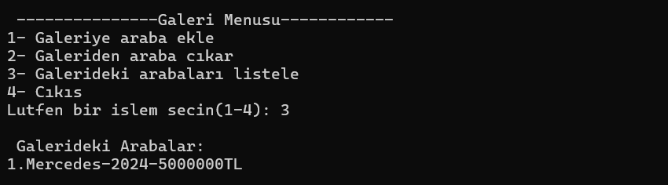

# 🚗 Galeri Uygulaması Proje 2

Bu proje, Python kullanılarak geliştirilen basit bir **araba galeri yönetim uygulamasıdır**.  
Kullanıcı, arabaları listeleyebilir, yeni arabalar ekleyebilir ve silebilir. Tüm veriler `.txt` dosyasında saklanır.

---

## 🔧 Kullanılan Teknolojiler

- Python 3.11
- Dosya işlemleri (`open`, `read`, `write`)
- PyInstaller ile `.exe` çıktısı oluşturuldu
- Git & GitHub ile versiyon kontrolü

---

## ✨ Uygulama Özellikleri

- ✅ Galeri listesi oluşturma veya mevcut listeyi seçme  
- ✅ Araba ekleme (marka, model, fiyat)  
- ✅ Araba silme (numaralı liste üzerinden)  
- ✅ Arabaları listeleme  
- ✅ Tüm işlemler `.txt` dosyasına kaydedilir  

---
## 🧭 Uygulamanın Kullanımı (Adım Adım)

### 1. Galeri Adı Girme  
Kullanıcıdan bir galeri adı istenir.  

### 2. Yeni Liste Oluşturma Sorusu  
Girilen isimde bir liste yoksa, yeni liste oluşturulsun mu diye sorulur.  

### 3. Liste Oluşturulduktan Sonra Menü Açılır  
Yeni liste başarıyla oluşturulur ve ana menü görüntülenir.  

### 4. Araba Ekleme İşlemi  
Kullanıcı 1’i seçerek marka, model ve fiyat bilgisi ile bir araba ekler.  

### 5. Araba Silme İşlemi  
Kullanıcı 2’yi seçerek numaralı listeden bir arabayı siler.  

### 6. Arabaları Listeleme  
Kullanıcı 3’ü seçerek galerideki mevcut arabaları listeler.  

## 🖥️ Uygulama EXE Olarak Derlendi 
